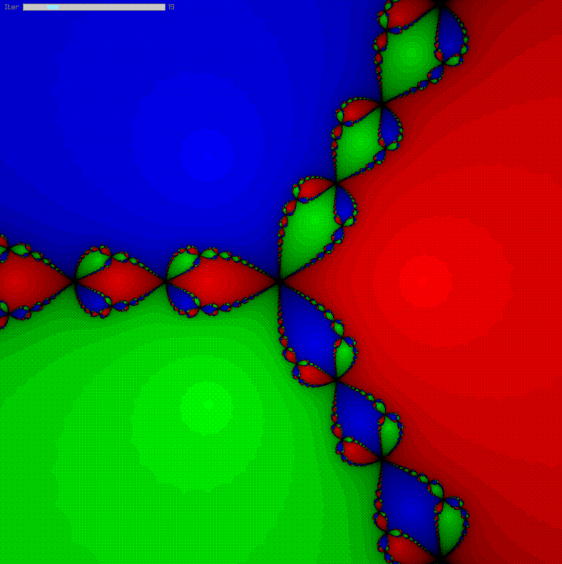
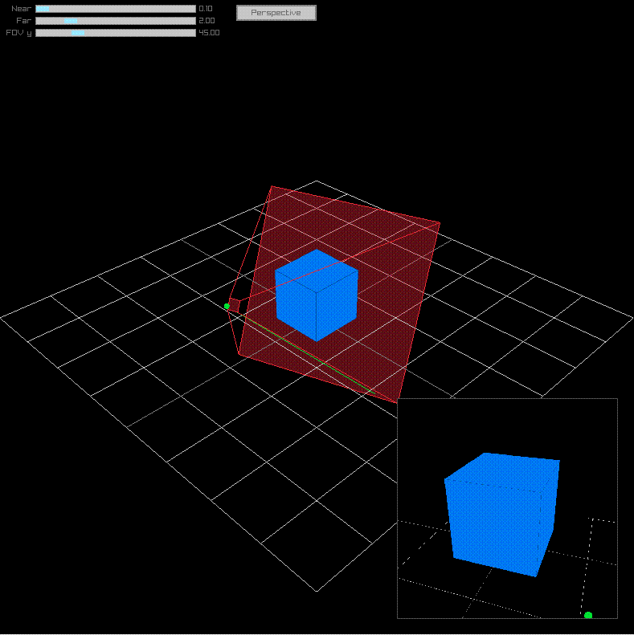
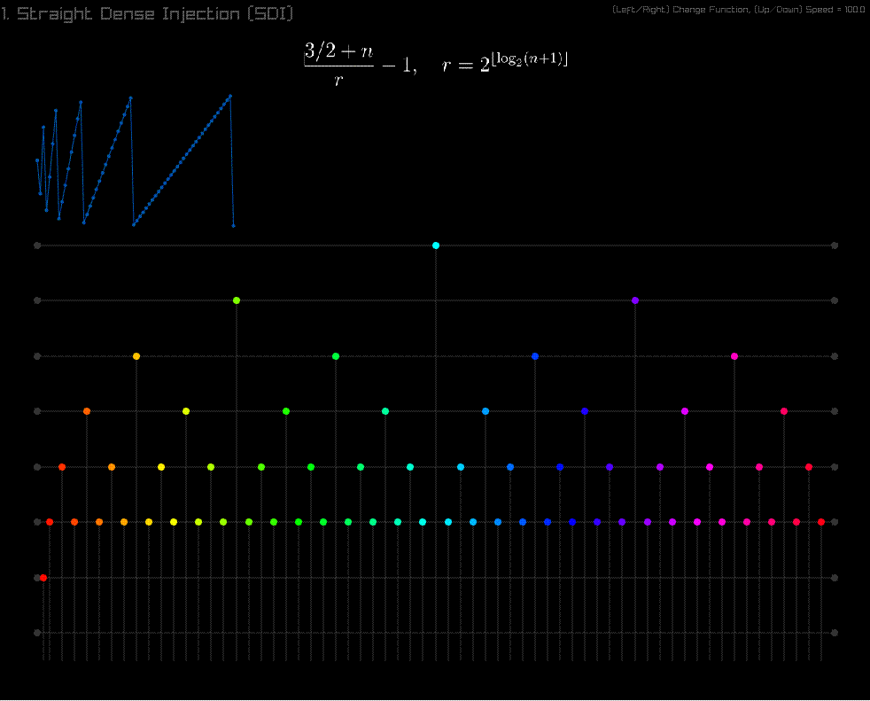
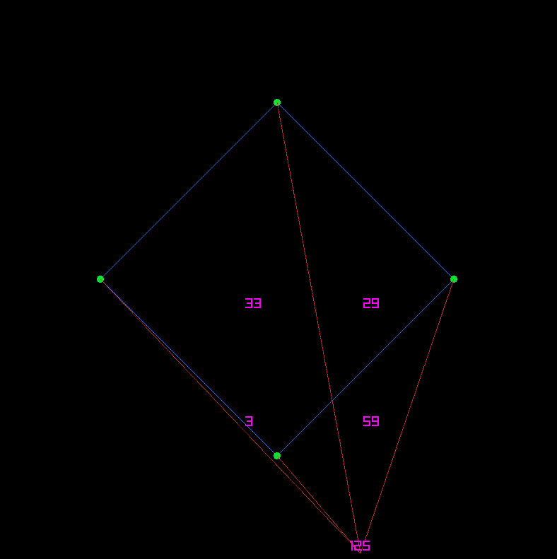
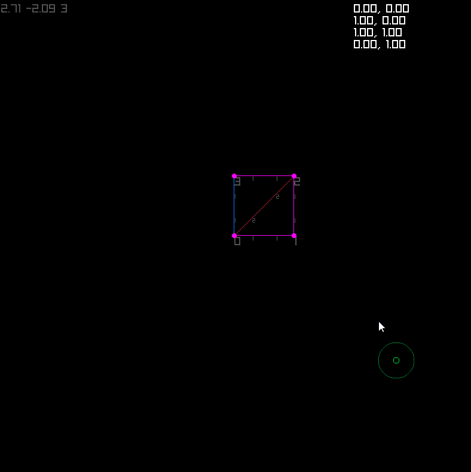
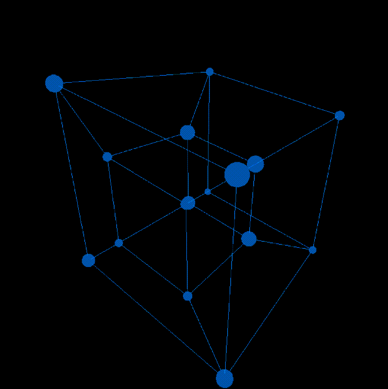

# raylib-examples

Newton Fractal|Unproject|Dense Injection
-|-|-
||
A simulation of Newton Fractals with shaders | Visualisation of perspective and projection matrices and their unprojected mouse position. | Visualisation of a mathematical formula that gets infinitely close to every point between 0 and 1 as function of integers. Includes LaTeX, used to make discrete algorithms finetune over time.

Point On Polygon|Triangle Net| ...
-|-|-
||In the future...
Shows how to compute whether a point is inside a **convex** polygon by counting angles. | Shows how to compute the perimeter of a patch of triangles. Used in [Mirai](https://github.com/arceryz/Mirai) to turn 3D model faces into polygons.

This contains many of my smaller raylib projects. There are a mix of C/C++. The code is not cleaned much. Cleaned projects are given a repository of their own (see below).

If you have questions on them you can always ask.

# Promoted Examples

These examples are cleaned and polished to get included in raylib. They belong in their own repository and are highly documented. I recommend learning from them first before the scraps you encounter here.

 [Raylib GPU Particles](https://github.com/arceryz/raylib-gpu-particles) | [Raylib Tesseract](https://github.com/arceryz/raylib-tesseract)| ...
-|-|-
 |  | For the uture.

